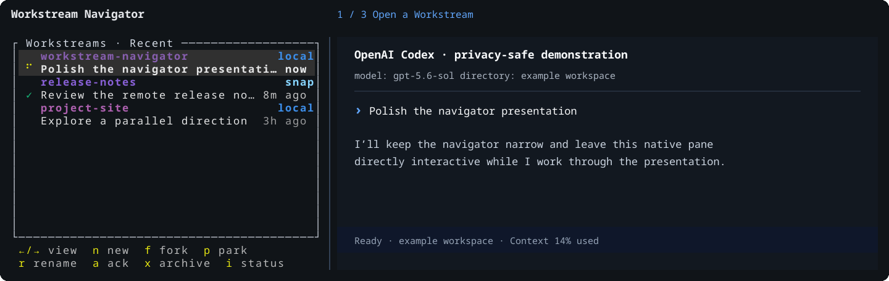

# Workstream Navigator

`wsnav` is a thin terminal layer for organizing persistent coding workstreams
across machines without replacing the coding agent's native terminal UI.

It is built for the workflow where Codex or OpenCode remains the place you
plan, code, select models and agents, resume history, and use native commands.
Workstream Navigator makes those sessions easier to find, enter, and park while
keeping the agent pane directly interactive.

## What it does

- Keeps a compact Workstreams navigator beside the native provider TUI.
- Organizes independent workstreams under explicitly registered Git projects.
- Starts fresh Codex or OpenCode workstreams, forks a live same-provider
  conversation at its last completed turn, parks sessions, resumes exact
  provider sessions, and recovers a conclusively lost runtime.
- Treats local and SSH hosts as first-class locations, with the same navigator
  workflow on both.
- Groups matching project locations across hosts without exposing raw remote
  URLs, credentials, filesystem paths, prompts, or transcripts.
- Uses one private tmux server per live runtime. It never uses or alters your
  normal tmux server.

## Native by design

Workstream Navigator owns navigation and runtime reachability; the selected
provider owns the conversation.

That means the native provider UI stays visible and interactive, including its
model, agent, permission, history, and conversation workflows. WSNav never
sends navigator status, task context, or management prompts into the provider
pane, and it preserves the completed provider result until you act.

### Managed native new-session boundary

Do not use Codex's native `/new` inside a WSNav-managed Codex pane. Codex
does create a distinct new chat, but its current lifecycle signals cannot prove
that the new chat belongs to that exact live WSNav Runtime. WSNav therefore
remains bound to the previous conversation tip: its displayed status, rename,
park, and resume actions still refer to that prior tip.

Use `/clear` for a fresh chat in the same Workstream. OpenCode-native session
creation or switching is likewise not used to rebind a managed Workstream.
Use WSNav's `n` for an independent Workstream, or `f` for a same-provider fork.
This is an explicit current limitation,
recorded in [Spikes 0011](docs/evidence/spikes/0011-codex-native-new-rebinding.md),
[0012](docs/evidence/spikes/0012-codex-new-prompt-session-rotation.md), and
[0013](docs/evidence/spikes/0013-codex-new-thread-inventory.md).

Each workstream starts from its registered project root. WSNav deliberately
does not create or manage branches, Git worktrees, commits, task records,
transcript copies, project memory, or autonomous agent teams. Use Codex and
ordinary Git tooling inside the native session when a task needs them.

## See it

The compact navigator remains a supporting surface; the adjacent native
provider pane keeps terminal focus and remains the place work happens. The tour
uses the normal 141×60 presentation split: 32 columns for navigation, one
divider, and the remaining 108 columns for the provider.



The hot path stays short: open a Workstream, fork at its last completed native
turn, or park it and resume the exact native thread later. The animation uses
the real navigator renderer with safe fixture data and a clearly labelled
Codex-pane representation; it contains no recorded provider session content.

Workstreams are project-first, ordered by activity, and carry only the status
needed to choose the next session. `n`, `f`, `p`, rename, archive, and the
other navigator actions stay in the small left pane.

Uncertain or unavailable state is visible rather than guessed: an exact native
resume is required for recovery, and an unreachable host never becomes a false
"stopped" session. See the [full capture set](docs/media/README.md) for
individual frames and generation details.

## Quick start

Workstream Navigator is currently a source-installed operator beta. Build and
install the reviewed checkout on the local host:

```console
git clone https://github.com/byebyebryan/workstream-navigator.git
cd workstream-navigator
cargo build --locked --release
install -m 755 target/release/wsnav ~/.local/bin/wsnav
wsnav
```

On the first launch, register a Project with `,`, then `a`, and choose its Git
directory. If Codex is the only eligible path, WSNav first opens its exact
passive observer profile for native hook review. When OpenCode is already
eligible, that Codex review is optional and remains available from Hosts;
approve it before starting a Codex Workstream. The host-private directory
browser starts at `~/code` by default; configure another browser root from
Hosts with `.` then `r`.

From the Workstreams home:

- `Enter` opens the selected native session.
- `n` starts a fresh workstream from the selected project's root. With multiple
  eligible providers, it opens a provider-only chooser initially selecting the
  current Workstream's provider.
- `f` forks the selected live Codex or OpenCode workstream at its last settled
  turn.
- `p` parks, `r` renames a supported native thread, and `x` archives a
  workstream. OpenCode Rename remains unavailable.
- `←` / `→` cycle Recent, By project, By host, and Archived views.
- `?` shows the complete keyboard reference inside the navigator pane.

## Add an SSH host

Install the same reviewed `wsnav` build on the remote host at
`~/.local/bin/wsnav`. In the local navigator, open Hosts with `.`, press `a`,
and enter the existing SSH destination (for example, `snap`). WSNav verifies
the remote compatibility, prepares its observer, and opens the remote native
Codex hook review in the right pane.

WSNav never copies, bootstraps, or updates a remote executable. A remote Codex
lane requires the same native hook review; OpenCode readiness is detected from
the bounded installed executable and its Runtime API contract. Confirm a
registered host before stateful work:

```console
wsnav host doctor <alias>
```

Cached remote workstreams stay visible when a host is unavailable, but actions
remain disabled until compatibility and connectivity are restored.

## Repository status

V1 is a source-installed `0.1.0` operator beta. The
[roadmap](docs/roadmap.md) is the sole authority for current checkpoint and
operator-acceptance status. There is no tagged binary release, automatic
updater, remote deployment service, crates.io publication, or compatibility
commitment to the earlier Python prototype.

The implementation supports Codex and installed OpenCode releases that satisfy
the bounded Runtime API/process contract for New, exact resume, same-provider
Fork, and lost-Runtime recovery. Real acceptance currently covers OpenCode
`1.18.11`; the release number is diagnostic evidence, not a compatibility pin.
Provider onboarding, filters, model/role presets, cross-provider Fork, and
automatic context transfer remain out of scope.

## Documentation

- [Product and architecture design](docs/design.md)
- [Delivery roadmap and acceptance gates](docs/roadmap.md)
- [Documentation map](docs/README.md)
- [Product captures](docs/media/README.md)
- [Historical acceptance, spike, and study evidence](docs/evidence/README.md)

## Development

The project requires Rust 1.88 or newer, Cargo Deny 0.20.x, Git, jq, Ruff
0.16.x, and ShellCheck.

```console
scripts/check
```

`wsnav register <path>` and the explicit CLI lifecycle commands remain
available for scripting, diagnostics, and break-glass use; ordinary operation
is designed to stay within the two-pane navigator.

## License

[MIT](LICENSE)
