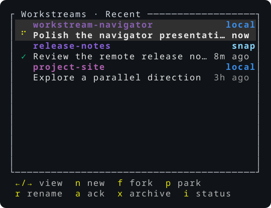
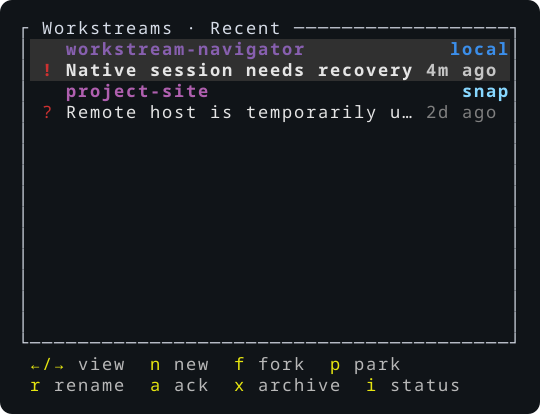

# Workstream Navigator

`wsnav` is a thin terminal layer for organizing persistent coding workstreams
across machines without replacing the coding agent's native terminal UI.

It is built for the workflow where Codex remains the place you plan, code,
rename threads, resume history, and use native commands. Workstream Navigator
makes those sessions easier to find, enter, park, recover, and fork while
keeping the agent pane directly interactive.

## What it does

- Keeps a compact Workstreams navigator beside the native Codex TUI.
- Organizes independent workstreams under explicitly registered Git projects.
- Starts fresh workstreams, forks a live Codex conversation at its last
  completed turn, parks sessions, and recovers a conclusively lost runtime.
- Treats local and SSH hosts as first-class locations, with the same navigator
  workflow on both.
- Groups matching project locations across hosts without exposing raw remote
  URLs, credentials, filesystem paths, prompts, or transcripts.
- Uses one private tmux server per live runtime. It never uses or alters your
  normal tmux server.

## Native by design

Workstream Navigator owns navigation and runtime reachability; Codex owns the
conversation.

That means the native provider UI stays visible and interactive, including
Codex's Plan mode, `/new`, `/clear`, `/fork`, `/rename`, resume flow, history,
and permissions. WSNav never sends navigator status, task context, or
management prompts into the provider pane, and it preserves the completed
provider result until you act.

Each workstream starts from its registered project root. WSNav deliberately
does not create or manage branches, Git worktrees, commits, task records,
transcript copies, project memory, or autonomous agent teams. Use Codex and
ordinary Git tooling inside the native session when a task needs them.

## See it

The compact navigator remains a supporting surface; the adjacent native Codex
pane keeps terminal focus and remains the place work happens.



Workstreams are project-first, ordered by activity, and carry only the status
needed to choose the next session. `n`, `f`, `p`, rename, archive, and the
other navigator actions stay in the small left pane.



Uncertain or unavailable state is visible rather than guessed: an exact native
resume is required for recovery, and an unreachable host never becomes a false
"stopped" session.

## Quick start

Workstream Navigator is currently a source-installed operator beta. Build and
install the reviewed checkout on the local host:

```console
git clone https://github.com/byebyebryan/workstream-navigator.git
cd workstream-navigator
cargo build --locked --release
install -m 755 target/release/wsnav ~/.local/bin/wsnav
wsnav
```

On the first launch, WSNav creates its exact passive Codex observer profile and
opens Codex's native hook review in the right pane. Approve that review, then
open Projects with `,`, press `a`, and choose the Git project to register. The
host-private directory browser starts at `~/code` by default; configure another
browser root from Hosts with `.` then `r`.

From the Workstreams home:

- `Enter` opens the selected native session.
- `n` starts a fresh workstream from the selected project's root.
- `f` forks the selected live Codex workstream at its last settled turn.
- `p` parks, `r` renames the native thread, and `x` archives a workstream.
- `←` / `→` cycle Recent, By project, By host, and Archived views.
- `?` shows the complete keyboard reference inside the navigator pane.

## Add an SSH host

Install the same reviewed `wsnav` build on the remote host at
`~/.local/bin/wsnav`. In the local navigator, open Hosts with `.`, press `a`,
and enter the existing SSH destination (for example, `snap`). WSNav verifies
the remote compatibility, prepares its observer, and opens the remote native
Codex hook review in the right pane.

WSNav never copies, bootstraps, or updates a remote executable. Confirm a
registered host before stateful work:

```console
wsnav host doctor <alias>
```

Cached remote workstreams stay visible when a host is unavailable, but actions
remain disabled until compatibility and connectivity are restored.

## Repository status

V1 is implemented through D7.6 as a source-installed `0.1.0` operator beta.
There is no tagged binary release, automatic updater, remote deployment
service, crates.io publication, or compatibility commitment to the earlier
Python prototype.

The implementation is Codex-first, but its host/runtime boundaries are kept
deliberately narrow so future provider support can be evaluated without
compromising the native-workflow model.

## Documentation

- [Product and architecture design](docs/design.md)
- [Delivery roadmap and acceptance gates](docs/roadmap.md)
- [Documentation map](docs/README.md)
- [Product captures](docs/media/README.md)
- [Historical acceptance, spike, and study evidence](docs/evidence/README.md)

## Development

The project requires the latest stable Rust toolchain, Cargo Deny 0.20.2, Git,
jq, Ruff 0.16.0, and ShellCheck.

```console
scripts/check
```

`wsnav register <path>` and the explicit CLI lifecycle commands remain
available for scripting, diagnostics, and break-glass use; ordinary operation
is designed to stay within the two-pane navigator.

## License

[MIT](LICENSE)
